# Expire Data Based on Age in Azure Blob Storage

**There are 2 objectives with this lab:**
* Upload the Photos to Blob Storage
* Add a Policy to the `img` Folder

## Upload the Photos to Blob Storage

Lets get logged into our Azure portal but first, we'll need to go to the GitHub link provided in the lab and download the images so we can upload them to our Azure storage container. Once we're in GitHub, we'll see the images we need to download. 

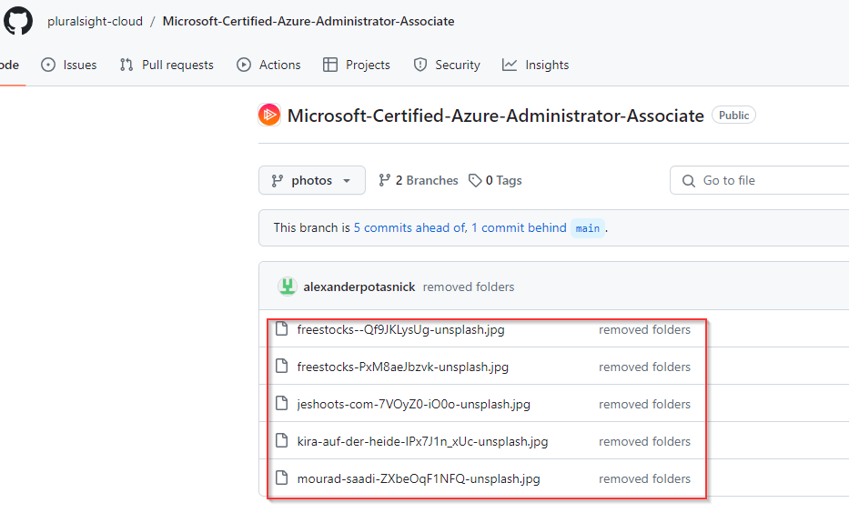

If you click on the image, you'll see a download link in the upper righthand corner. Click this link for all 5 images. 

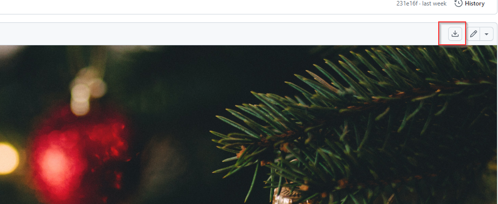

Now, lets return to the portal and click on our storage account.

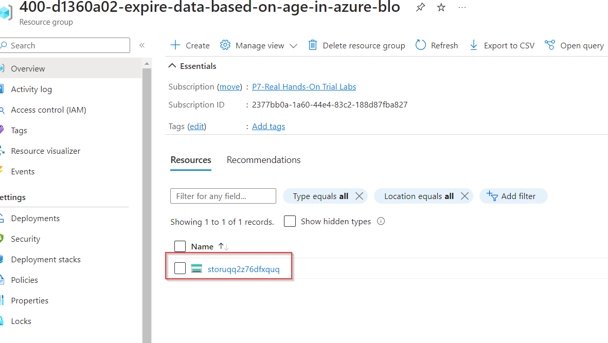

Once here, we'll click on the `Containers` blade under the `Data storage` section. On this page, we'll click `+ Container` at the top to add a new container. 

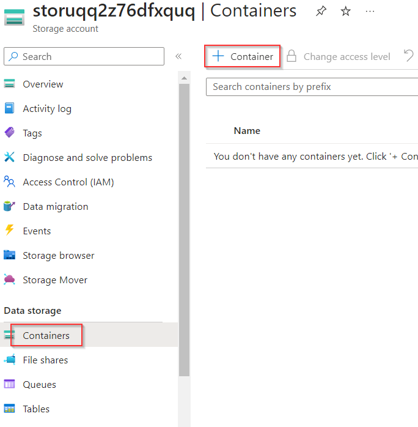

We're going to name our new container `holidaysale` and click create. 

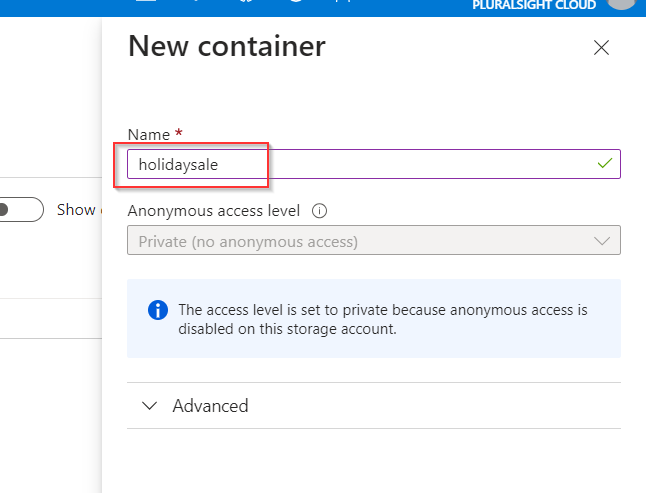

We're going to create a folder named `img` and add our GitHub images into the folder. So click on the newly created holidaysale container. At the top of this page, you'll see `upload`. Clear here and on the right side of the page, you'll be able to upload your images at the top of the pop-up menu. You can also create your folder in the `Upload to folder` section. Once you click create, you should have a folder named `img` with the images you've downloaded from GitHub.

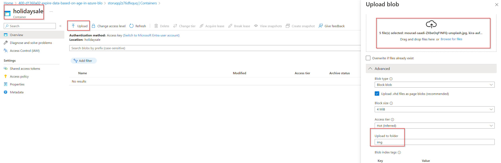

Once you click create, you should have a folder named `img` with the images you've downloaded from GitHub.

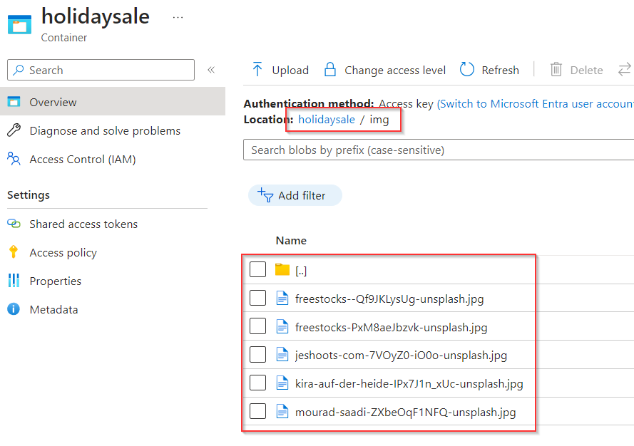

That completes this portion of the lab! Onto the next objective.

## Add a Policy to the `img` Folder

So for the last task, we need to create a 30 day deletion policy on our newly created `img` folder. So lets head back to the original storage account. Here, navigate to Data management > Lifecycle management. Under this blade, choose the `+ Add a rule` option at the top of the page. 

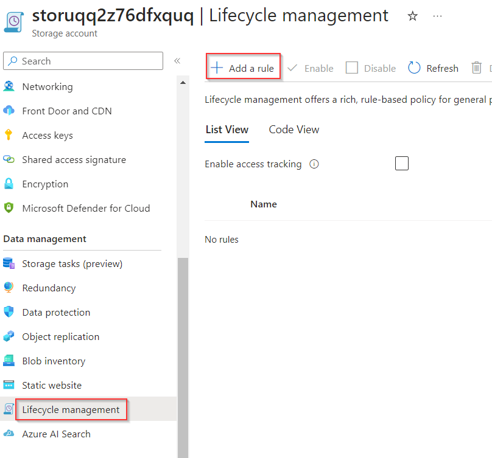

Once here, we can name our rule and we'll choose the `Limit blobs with filters` option so that we can specifically apply this rule to our `holidaysale/img` directory. 

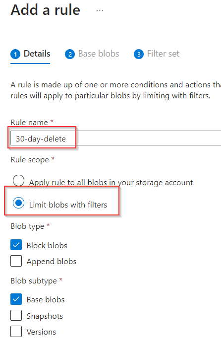

On the next page, we create the conditions of the rule. There's an if-then clause. So I chose 30 days as the deletion parameter. 

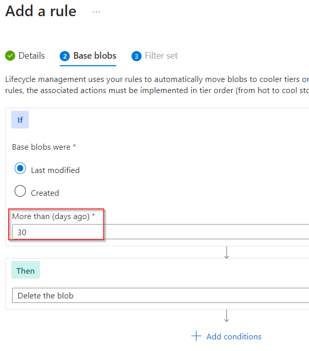

This last page is where we're able to apply it specifically to our directory. So put that information in and then we'll create the rule. 

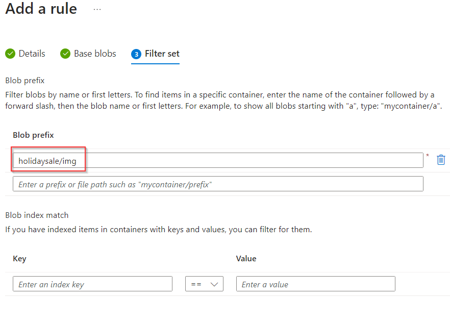

You can see the newly created policy under the rules and that completes this lab!

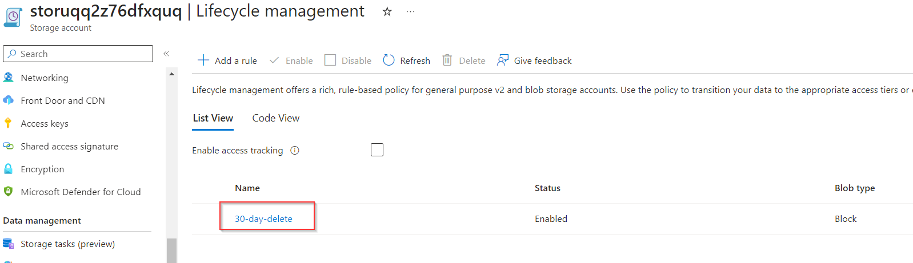

Another one in the bag. 

## Personal Notes

This was an easier lab. I was a little confused at the end because I didn't know I needed to select the `Limit blobs with filters` to be able to apply the policy specifically to the `img` directory. My original rule applied the policy to the entire container which was not the objective of the lab. Other than that, the lab wasnt difficult. 
